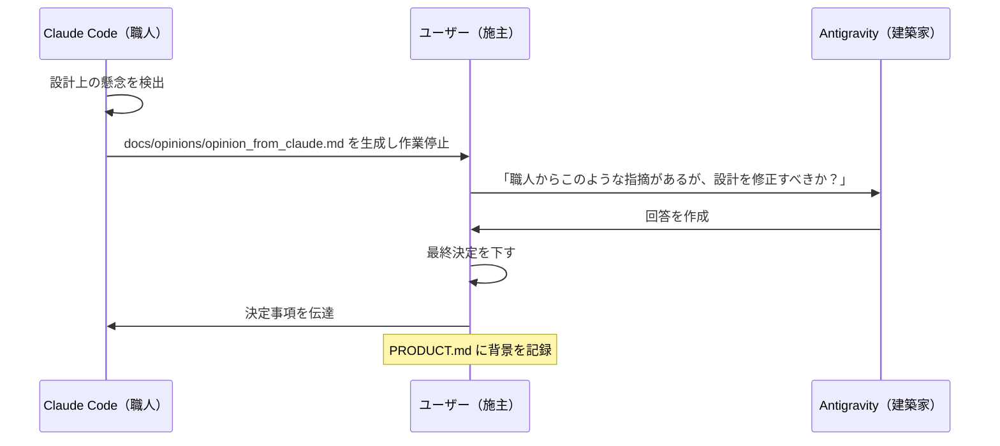

# 🏛️ ArchCraft - AI協調開発フレームワーク

## 目的

ArchCraftは、**2つのAI（AG：建築家 / CC：職人）の役割分離と相互レビュー**によって、個人開発でも高品質なソフトウェアを構築するためのフレームワークである。

### 解決する課題

| 課題 | ArchCraftの解決策 |
|------|------------------|
| AIに曖昧な指示を出すと、意図しない実装になる | 詳細な設計書・実装計画を作成してから実装 |
| 要件の抜け漏れに後から気づく | 段階的な要件定義・設計フェーズで詳細化 |
| AIの出力を鵜呑みにしてしまう | 相互レビューで品質を担保 |
| プロジェクトの状態が分からなくなる | PRODUCT.md で唯一の真実（SSoT）を管理 |

### 基本原則

1. **役割分離の原則**: AGは設計に専念し、CCは実装に専念する
2. **相互レビューの原則**: 各AIは相手の成果物を検証する義務を持つ
3. **ユーザー主権の原則**: 最終決定権は常にユーザーにある
4. **設計優先の原則**: 設計書なしに実装を開始しない

---

## ディレクトリ構成

```
project/
├── PRODUCT.md           # プロジェクトの唯一の真実（SSoT）
├── ArchCraft.md         # このファイル（フレームワーク説明）
├── CLAUDE.md            # CC（職人）向け指示書
├── GEMINI.md            # AG（建築家）向け指示書
├── README.md            # プロジェクト説明
├── .agent/
│   └── workflows/       # フェーズ別ワークフロー
│       ├── phase-0-init.md
│       ├── phase-1-requirements.md
│       ├── phase-2-tech-stack.md
│       ├── phase-3-guidelines.md
│       ├── phase-4-design.md
│       ├── phase-5-environment.md
│       ├── phase-6-implementation.md
│       └── completion.md
├── docs/
│   ├── requirements.md      # 要件定義書（Phase 1）
│   ├── tech-stack.md        # 技術選定書（Phase 2）
│   ├── setup.md             # 環境構築手順（Phase 5）
│   ├── guidelines/          # ガイドライン（Phase 3）
│   │   ├── coding.md
│   │   └── ...
│   ├── design/              # 設計書（Phase 4）
│   │   ├── index.md         # 設計書インデックス・参照マップ
│   │   ├── basic-design.md
│   │   ├── db/
│   │   ├── api/
│   │   └── screens/
│   ├── plans/               # 実装計画（Phase 6-8）
│   │   └── [タスクID]-plan.md
│   └── opinions/            # 意見書（CC→ユーザー）
├── src/                     # ソースコード
└── tests/                   # テストコード
```

---

## フェーズ概要

| Phase | 名称 | 担当 | 成果物 | ワークフロー |
|-------|------|------|--------|-------------|
| 0 | 初期化 | AG | PRODUCT.md, README.md | [phase-0-init.md](.agent/workflows/phase-0-init.md) |
| 1 | 要件定義 | AG | docs/requirements.md | [phase-1-requirements.md](.agent/workflows/phase-1-requirements.md) |
| 2 | 技術選定 | AG | docs/tech-stack.md | [phase-2-tech-stack.md](.agent/workflows/phase-2-tech-stack.md) |
| 3 | ガイドライン | AG | docs/guidelines/* | [phase-3-guidelines.md](.agent/workflows/phase-3-guidelines.md) |
| 4 | 設計 | AG | docs/design/* | [phase-4-design.md](.agent/workflows/phase-4-design.md) |
| 5 | 環境構築 | AG+CC | docs/setup.md, Jira | [phase-5-environment.md](.agent/workflows/phase-5-environment.md) |
| 6-8 | 実装・検証 | AG+CC | src/*, tests/* | [phase-6-implementation.md](.agent/workflows/phase-6-implementation.md) |
| - | 完了・維持 | AG | CI/CD, ドキュメント | [completion.md](.agent/workflows/completion.md) |

---

## How To: ArchCraftの使い方

### 1. プロジェクト開始

```
ユーザー: /phase-0-init
AG: プロジェクトを初期化します...
```

AGに `/phase-0-init` コマンドを実行させると、ワークフローに沿って初期化が行われる。

### 2. 各フェーズの進め方

```
ユーザー: /phase-1-requirements
AG: 要件定義を開始します。いくつか質問させてください...
```

- 各フェーズはワークフロー（`.agent/workflows/`）に沿って進行
- AGがユーザーに質問しながら詳細化
- 成果物作成後、CCにレビューを依頼
- ユーザー承認後、次フェーズへ

### 3. 実装フェーズ（Phase 6-8）

```
ユーザー: /phase-6-implementation
AG: Jiraから次のタスクを確認します...
    [タスク名]の実装計画を作成しました。CCに実装を依頼してよいですか？
ユーザー: OK
AG: （CCに実装計画を渡す）
CC: TDD形式で実装します...
AG: コードレビューします...
```

- AGが実装計画を作成
- CCがTDD形式で実装
- AGがコードレビュー
- 承認後コミット

### 4. 進捗確認

`PRODUCT.md` を確認すれば、現在のフェーズ・進捗・決定事項が分かる。

---

## 対立解消プロトコル

CCが設計に異論を唱える場合:

1. `docs/opinions/opinion_from_claude.md` を作成
2. 作業を一時停止（Blocked）
3. ユーザーの仲裁を待つ
4. 決定事項を `PRODUCT.md` に記録

### AI間通信プロトコル（間接議論フロー）

AI同士の直接の競合やコンテキストの混乱を防ぐため、議論は**間接方式**で行う。



---

## 開発・安全基準

| 項目 | 基準 |
|------|------|
| **開発プロセス** | ウォーターフォール形式による段階的承認（Phase 1〜8） |
| **実装パターン** | テスト駆動開発（TDD）の徹底 |
| **出力言語** | 全てのドキュメント、タスク出力は**日本語**とする |
| **設計優先** | 設計書なしに実装を開始しない |
| **安全措置** | 破壊的コマンドやファイル削除には必ずユーザーの承認を求める |

---

## フェーズ判定ロジック

各フェーズの完了は、成果物の生成によって判定される。

| Phase | 名称 | 完了条件（成果物） |
|-------|------|------------------|
| 0 | 初期化 | `PRODUCT.md`, `README.md` 生成完了 |
| 1 | 要件定義 | `docs/requirements.md` 生成完了 |
| 2 | 技術選定 | `docs/tech-stack.md` 生成完了 |
| 3 | ガイドライン | `docs/guidelines/coding.md` 生成完了 |
| 4 | 設計 | `docs/design/index.md`, `basic-design.md` 生成完了 |
| 5 | 環境構築 | `docs/setup.md` 生成完了、Jiraタスク登録完了 |
| 6-8 | 実装・検証 | `PRODUCT.md` の phase 値で管理 |

---

## 安全基準

- 破壊的コマンドには必ずユーザー承認を求める
- ファイル削除前に確認プロンプトを表示
- 本番環境への直接アクセスは禁止
- 設計書なしに実装を開始しない
